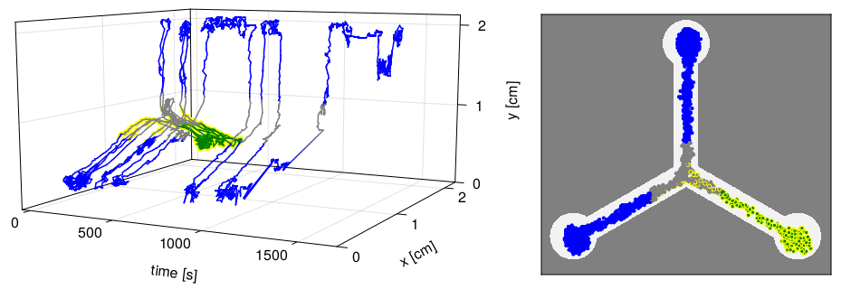
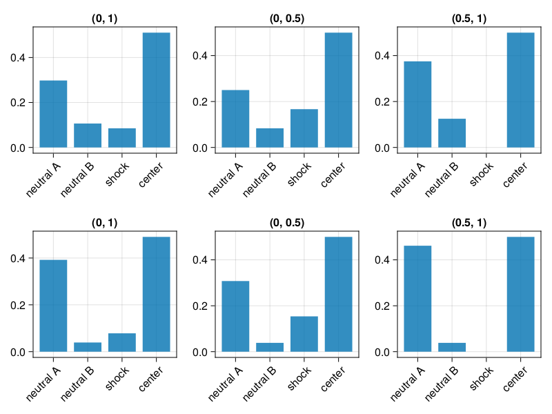
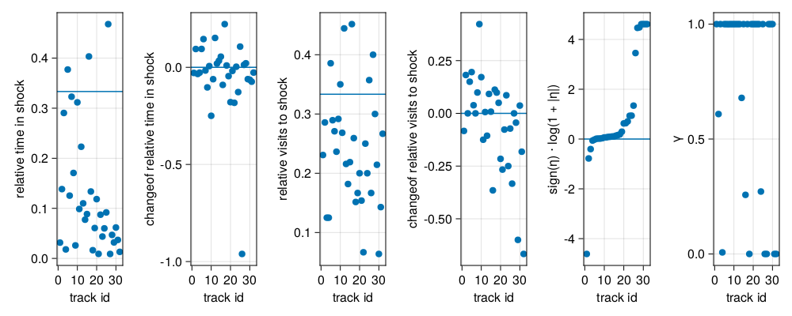
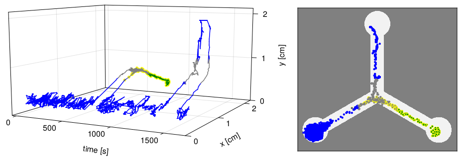
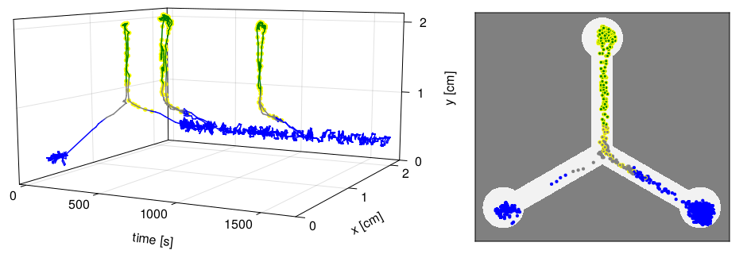
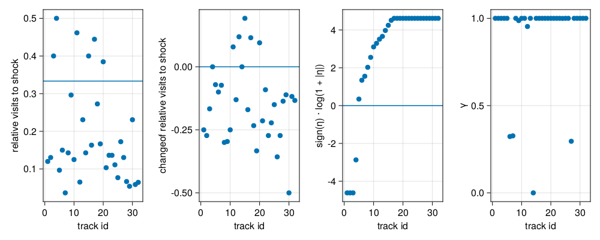
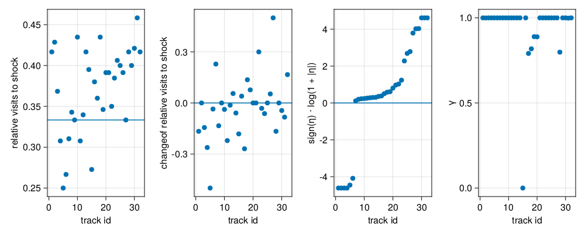

# Fitting a reinforcement learning model to an abstract representation of the data
## Loading the data

This is an example where we first encode the data to an abstract form and then fit a
policy gradient reinforcement learning method.

First we load the data and plot one recording.

```
using FlyRL, DataFrames
import FlyRL: read_directory, plot_track

tracks = FlyRL.read_directory("data/dgrp_362/dgrp362_shock",
                              drop_outliers = true,
                              pattern = r"^track",
                              warn_outliers = false);

plot_track(tracks[end])
```


Blue and green indicate the color of the arm, yellow dots indicate shocks and gray
indicates the center of the maze.

## Preprocessing the data
Now we define a preprocessor of the raw data.
```
import FlyRL: Preprocessor, ShockArmEncoder, DynamicCompressEncoder, MarkovKEncoder,
              VectorEncoder, LevelEncoder, preprocess

preprocessor = Preprocessor(input = ShockArmEncoder() |>
                                    x -> DynamicCompressEncoder(:shock_arm, x) |>
                                    x -> MarkovKEncoder(2, x) |>
                                    x -> VectorEncoder(x, intercept = true),
                                    target = ShockArmEncoder() |> LevelEncoder);

input, target, shock = preprocess(preprocessor, tracks[end])
```
With this `preprocessor`, `input` is a list of vectors with one-hot encoding of the arm,
`target` is a list of levelcodes of the next arm and `shock` is a list of average number
of shocks per time step. Instead of roughly $10^4$ time steps as in the raw data
`tracks[end]`, the `DynamicCompressEncoder` compressed the subsequent time steps where the
fly was in the same abstract state (e.g. in the shock arm) into one step, such that the
input, target and shock sequences have now an approximate length of 50.

## Fitting a reinforcement learning agent
Next we define a simple policy gradient agent to fit the data and compute the
log-probability of the data given the model and some default parameters that include the
discount factor, the learning rate and the initial transition probabilities between
abstract states.

```
import FlyRL: Model, PolicyGradientAgent, params, logprob

model = Model(PolicyGradientAgent(Din = length(input[1]),
                                  Dout = length(FlyRL.levels(preprocessor.target.encoder)[1])),
                                  preprocessor);
θ = params(model) # some default parameters
logprob(model, tracks[end], θ)
```

Let us now find the parameters that optimize the log-probability.

```
import FlyRL: train
result = train(model, tracks[end], θ, maxtime = 20, print_interval = 3)
```

The log-probability with the fitted parameters is much higher than the value we obtained
above.
```
logprob(model, tracks[end], result.params)
```

## Generate simulated data
We can now use the fitted model to obtain simulated tracks.
```
import FlyRL: Environment, in_shock_arm, simulate

env = Environment(; preprocessor, shock = in_shock_arm);
x, s, a, logp = simulate(model.agent, env, result.params, 50)
```

We can look at the simulation result by decoding the states `x`
```
import FlyRL: decode

decode(preprocessor.input, x) |> DataFrame
```

Let us compare the simulated data to the recorded data
```
import FlyRL: plot_compare_probs

plot_compare_probs(decode(preprocessor.input, input).shock_arm,
                   decode(preprocessor.input, x).shock_arm)
```


The top row shows the visitation counts of the different arms in the recorded data and the
bottom row shows them for one simulated trial. The first column shows the visitation
counts over the whole trajectory (from relative time 0 to relative time 1). The middle row
shows the visitation count for the first half of the trial and the last column shows the
visitations counts for the second half. We see that the visitation count of the shock arm
went down from the first to the second half, both in the recording (top) and the
simulation (bottom). Because the simulations are stochastic, each simulated trial will
look different, but on average a reduction of the visits to the shock arm is visible.

## Model-fitting for data analysis

Let us fit a few recorded tracks and look at the learning rates and discount factors.
```
function fit_lr_and_gamma(model, tracks)
    η = Float64[]
    γ = Float64[]
    for track2fit in tracks
        θ = params(model)
        res = train(model, track2fit, θ, maxtime = 10, print_interval = 9)
        push!(η, res.params.η)
        push!(γ, FlyRL.sigmoid(res.params.logitγ))
    end
    (; η, γ)
end
lr_and_gamma = fit_lr_and_gamma(model, tracks) # this may take some time
```

We plot now some summary statistics of the data, together with the fitted parameters.
```
import FlyRL: plot_summaries
import FlyRL: RelativeVisitsToShockArm, RelativeTimeInShockArm, ChangeOf
using CairoMakie

function plot_stats_and_fits(tracks, lr_and_gamma;
        summaries = (RelativeTimeInShockArm(), ChangeOf(RelativeTimeInShockArm()),
                     RelativeVisitsToShockArm(), ChangeOf(RelativeVisitsToShockArm())),
        f = Figure(resolution = (1000, 400)))
    sp = sortperm(lr_and_gamma.η)
    plot_summaries(tracks; f, sortperm = sp, summaries)
    ax = Axis(f[1, length(summaries) + 1], ylabel = "sign(η) ⋅ log(1 + |η|)", xlabel = "track id")
    scatter!(ax, eachindex(lr_and_gamma.η), sign.(lr_and_gamma.η[sp]) .* log.(1 .+ abs.(lr_and_gamma.η[sp])))
    hlines!(ax, 0.)
    ax = Axis(f[1, length(summaries) + 2], ylabel = "γ", xlabel = "track id")
    scatter!(ax, eachindex(lr_and_gamma.γ), lr_and_gamma.γ[sp])
    f
end
plot_stats_and_fits(tracks, lr_and_gamma)
```

The tracks are sorted by ascending learning rate (5th panel).
Not surprisingly, the learning rate seems to correlate with the change of relative visits
to the shock arm. There is no obvious pattern for the discount factor $\gamma$.

The largest learning rate was obtained for a track, where the shocked arm was visited
once and never again.


A negative learning rate was obtained for a track where the fly alternated only between
one neutral arm and the shock arm. Note that the simple abstract model we are using here
is not capable of capturing the longer durations spent in the neutral arm.


Do the differences in learning rate (or other statistics) indicate that there are
fundamental differences between the different flies, or could $N$ copies of the exact same
fly lead to the same observed differences in learning rates etc., simply because action
selection is random and the trials are of limited length?
In simulations we can create multiple runs of the exact same model and only vary the
initial conditions and the seed of the pseudo-random number generator.
In the following we use the fitted parameters found in [Fitting a reinforcement learning agent](@ref)
and we simulate tracks that have the same duration as the recorded tracks.

```
function simulated_tracks(model, env, θ, Ts)
    res = []
    for T in Ts
        x, s, = simulate(model.agent, env, θ, T)
        df = decode(model.preprocessor.input, x[2:end]) |> DataFrame
        df.shock = s
        push!(res, select(df, [:shock_arm, :shock]))
    end
    res
end
Ts = length.(first.(preprocess.(Ref(preprocessor), tracks)))
sim_tracks = simulated_tracks(model, env, result.params, Ts)
sim_lr_and_gamma = fit_lr_and_gamma(model, sim_tracks) # this may take some time
plot_stats_and_fits(sim_tracks, sim_lr_and_gamma,
        summaries = (RelativeVisitsToShockArm(), ChangeOf(RelativeVisitsToShockArm())))
```

We see indeed a large variability between different simulated runs with exactly the same
model. Note that we do not plot the relative time spent in the shock arm, because our
abstract model does not simulate the durations spent in each arm.

Could we even get similar behaviour, if the learning rate were 0?
```
newparams = copy(result.params)
newparams.η = 0.
sim_tracks2 = simulated_tracks(model, env, newparams, Ts)
sim_lr_and_gamma2 = fit_lr_and_gamma(model, sim_tracks2) # this may take some time
plot_stats_and_fits(sim_tracks2, sim_lr_and_gamma2,
        summaries = (RelativeVisitsToShockArm(), ChangeOf(RelativeVisitsToShockArm())))
```

One does indeed get similar differences between the different simulated tracks.
In contrast to the simulations with positive learning rates, however, many fitted learning
rates are close to zero and there is roughly an equal number of strongly positive and
strongly negative learning rates.
