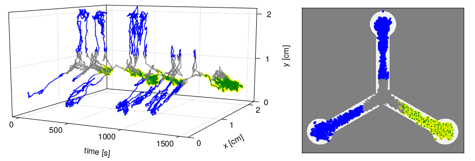
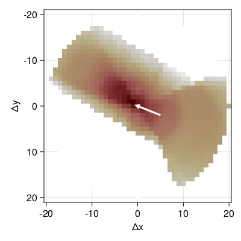

# Fitting a static model to the raw data

We load the same data as in the previous example. But this time we intend to simulated the
actual movement of the fly in densly discretized time and space.

```
using FlyRL, DataFrames
import FlyRL: read_directory, plot_track

tracks = FlyRL.read_directory("data/dgrp_362/dgrp362_shock",
                              drop_outliers = true,
                              pattern = r"^track",
                              warn_outliers = false);
```

We will use a model, where the probability of moving to a neighbouring x-y-position
depends on the speed, the angle relative to the current orientation, previous speed and
angle and the distances to the next walls. This probability will be parameterized by a
simple feedforward neural network with one hidden layer of 32 neurons.
```
import FlyRL: Preprocessor, VectorEncoder, ColumnPicker, DeltaPositionEncoder,
              FutureDeltaTimeEncoder, MarkovKEncoder, OrientationEncoder, SpeedEncoder,
              AngleEncoder, DeltaPositionIndexEncoder
import FlyRL: Model, StationaryAgent, DeltaPositionModel, MLP, DenseLayer

preprocessor = Preprocessor(input = VectorEncoder(ColumnPicker(:x),
                                                  ColumnPicker(:y),
                                                  DeltaPositionEncoder(),
                                                  FutureDeltaTimeEncoder(),
                                                  MarkovKEncoder(2, SpeedEncoder()),
                                                  MarkovKEncoder(2, AngleEncoder()),
                                                  MarkovKEncoder(2, OrientationEncoder())),
                            target = DeltaPositionIndexEncoder());
model = Model(StationaryAgent(Dout = length(preprocessor.target.lookup),
                              model = DeltaPositionModel(f = MLP(DenseLayer(17, 32, tanh),
                                                                 DenseLayer(32, 1, identity)))),
              preprocessor);
```

We will fit this model to the data from the following track


For fitting we start julia with multiple threads, e.g. `julia -t8` re-run the code above,
split the data of the last track into 8 junks (first line below), and use the `Adam`
optimizer to fit the data for 6 hours.

```
data = [tracks[end][i*nrow(tracks[end])÷8+1:(i+1)*nrow(tracks[end])÷8, :] for i in 0:7];
opt = FlyRL.Adam()
result = FlyRL.train(model, data, θ, lb = -25, ub = 25,
                     opt = opt, batchsize = 32,
                     maxtime = 6*60*60, print_interval = 60)
```

Now we can simulate from the fitted model.
```
import FlyRL: Environment, simulate, in_right

env = Environment(; preprocessor, shock = in_right);
env.state .= preprocess(preprocessor, tracks[end]).input[1]
x, s, = simulate(model.agent, env, result.params, 10^4);
simtrack = FlyRL.decode(preprocessor.input, x) |> DataFrame
simtrack.pattern = fill("BBG", nrow(simtrack));
simtrack.shock = [s .== 1; false];
plot_track(simtrack)
```



It looks somewhat close to an actual fly track, but the trajectory looks still a bit less
smooth than the recordings and the simulated fly seems to spend less time in the turns.

We can also have a look at the probabilities of the next action.
```
import FlyRL: plot_delta_pos_probs

plot_delta_pos_probs(model.agent)
```

The white arrow indicates the previous action, the color indicates the log-probability of
the next action, where dark red means high probability and white means zero probability.
The simulated fly is about to leave the turn in the bottom right.
We can see that the fitted model puts low probabilities close to the walls and the highest
probabilties are in a cone in almost the same direction as the white arrow.

